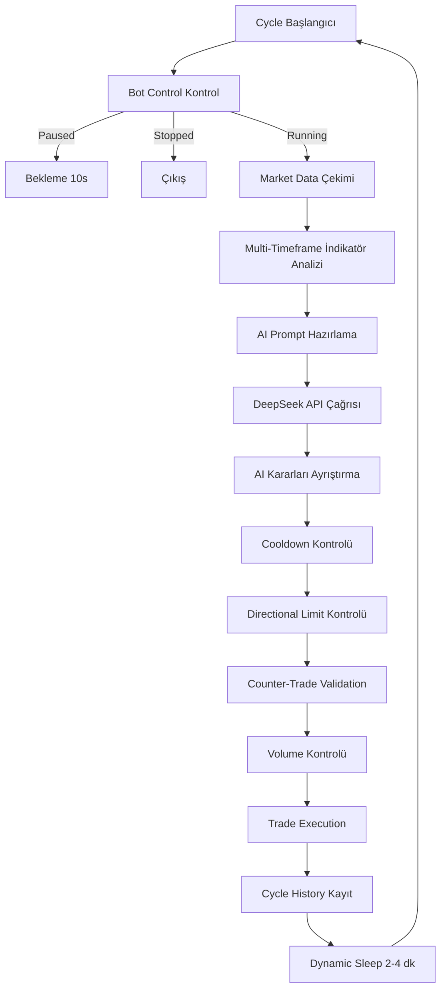

# TradeSeeker: Hibrit Yapay Zeka Destekli Sistematik Alım-Satım Sistemi
**Teknik Detaylı Proje Sunum Dokümanı**  
**Versiyon:** V9 - Auto TP/SL, Dynamic Size, Prompt Eng

---

## 📁 Proje Yapısı

```
TradeSeeker-main/
├── config/
│   └── config.py          # Tüm konfigürasyon parametreleri (251 satır)
├── src/
│   ├── main.py            # Ana bot mantığı ve AI entegrasyonu (3018 satır)
│   ├── core/
│   │   ├── portfolio_manager.py   # Pozisyon yönetimi, TP/SL (3606 satır)
│   │   ├── market_data.py         # Binance veri çekimi
│   │   ├── backtest.py            # Risk yönetimi
│   │   ├── cache_manager.py       # İndikatör cache
│   │   └── performance_monitor.py # Performans izleme
│   ├── ai/
│   │   ├── deepseek_api.py        # DeepSeek API entegrasyonu
│   │   ├── prompt_json_builders.py # AI prompt oluşturma
│   │   └── enhanced_context_provider.py # Gelişmiş context
│   └── services/
│       ├── binance.py     # Binance order execution
│       └── alert_system.py # Alarm sistemi
└── data/
    ├── portfolio_state.json    # Portföy durumu
    ├── trade_history.json      # Trade geçmişi
    ├── cycle_history.json      # Cycle geçmişi
    └── bot_control.json        # Bot kontrol (pause/stop)
```

---

## 1. Projenin Amacı ve Kapsamı
Bu proje, finansal piyasalarda (Kripto Para) duygusal kararları elimine eden, veri odaklı ve otonom bir alım-satım sistemi (Trading Bot) geliştirmeyi amaçlar. Sistem, klasik algoritmik yaklaşımları (Teknik Analiz) modern **Büyük Dil Modelleri (LLM - DeepSeek)** ile birleştirerek "Hibrit Bir Zeka" oluşturur.

---

## 2. Sistem Mimarisi ve Çalışma Mantığı (Workflow)



### Adım 1: Veri Toplama ve İşleme (The Sensory Layer)
Sistem her döngüde (Cycle) piyasadan ham veriyi (Fiyat, Hacim) çeker ve işler.
*   **Zaman Dilimleri:** 1 Saatlik (Trend), 15 Dakikalık (Momentum), 3 Dakikalık (Giriş) veriler paralel işlenir.
*   **Özellik Mühendisliği (Feature Engineering):** Ham veriden türetilmiş veriler (RSI, EMA, ATR) hesaplanır.
*   **Gelişmiş Bağlam:** Fiyat hareketleri ASCII karakterlerine (Sparklines) dönüştürülerek AI'a "Görsel" bir özet sunulur.

### Adım 2: Bağlam Oluşturma (The Context Layer)
Toplanan tüm veriler, AI'ın anlayabileceği yapılandırılmış bir **JSON Prompt** formatına dönüştürülür.
*   *Örnek:* "RSI: 75" verisi, "RSI_Overbought" etiketiyle zenginleştirilir.
*   *Örnek:* Hacim verisi, son 20 mumun ortalamasıyla kıyaslanıp "Volume Ratio" (Hacim Oranı) olarak sunulur.

### Adım 3: Yapay Zeka Analizi (The Reasoning Layer)
Hazırlanan veri paketi **DeepSeek AI** modeline gönderilir. AI, kendisine verilen "Fon Yöneticisi" kişiliğiyle veriyi yorumlar:
1.  **Trend Analizi:** Fiyat EMA'nın üzerinde mi? (Yön Tayini)
2.  **Risk Analizi:** RSI çok mu şişik? Piyasa testere (Choppy) modunda mı?
3.  **Karar:** Al (Buy), Sat (Sell) veya Bekle (Hold).

### Adım 4: Güvenlik ve Filtreleme (The Safety Layer)
AI "Al" dese bile, sistemin Python tarafındaki **"Katı Kurallar" (Hard Rules)** devreye girer:
*   **Hacim Filtresi:** Hacim ratio < 0.20x ise işlem reddedilir.
*   **Slot Kontrolü:** Maksimum 5 işlem, aynı yönde max 2 pozisyon limiti.
*   **Soğuma (Cooldown):** Kayıp sonrası 4 cycle, kar sonrası 2 cycle bekleme.
*   **Trend Flip Guard:** Yeni trend değişimlerinde belirli cycle bekleme.

### Adım 5: İcra ve Yönetim (The Execution Layer)
Tüm filtreleri geçen kararlar uygulanır.
*   **Dinamik TP/SL:** ATR tabanlı hedefler ile piyasa oynaklığına adaptasyon.

---

## ⚙️ Config Parametreleri

### Temel Ayarlar
| Parametre | Değer | Açıklama |
|-----------|-------|----------|
| `INITIAL_BALANCE` | $200 | Başlangıç bakiyesi |
| `CYCLE_INTERVAL_MINUTES` | 2 dk | Cycle aralığı |
| `HISTORY_RESET_INTERVAL` | 35 cycle | Bias reset aralığı |

### Risk Yönetimi
| Parametre | Değer | Açıklama |
|-----------|-------|----------|
| `MAX_LEVERAGE` | 20x | Maksimum kaldıraç |
| `MIN_CONFIDENCE` | 0.4 | Minimum AI güven |
| `MAX_POSITIONS` | 5 | Maksimum açık pozisyon |
| `RISK_PER_TRADE_USD` | $3 | Trade başına sabit risk |
| `SAME_DIRECTION_LIMIT` | 2 | Aynı yönde max pozisyon |

### Stop Loss / Take Profit
| Parametre | Değer | Açıklama |
|-----------|-------|----------|
| `ATR_TP_MULTIPLIER` | 2.0x | TP = Entry ± (ATR × 2) |
| `ATR_SL_MULTIPLIER` | 1.5x | SL = Entry ± (ATR × 1.5) |

### Trailing Stop
| Parametre | Değer | Açıklama |
|-----------|-------|----------|
| `TRAILING_PROGRESS_TRIGGER` | 40% | TP'ye %40 ilerleme → aktif |
| `TRAILING_TIME_MINUTES` | 20 dk | Zamana bağlı aktivasyon |
| `TRAILING_ATR_MULTIPLIER` | 1.2x | ATR bazlı buffer |

### Smart Cooldown
| Parametre | Değer | Açıklama |
|-----------|-------|----------|
| `SMART_COOLDOWN_LOSS` | 4 cycle | Kayıp sonrası bekleme |
| `SMART_COOLDOWN_WIN` | 2 cycle | Kar sonrası bekleme |

---

## 3. Teknik İndikatörler ve Matematiksel Hesaplamalar

### 3.1. Exponential Moving Average (EMA) - Üstel Hareketli Ortalama
Fiyatın yönünü (Trend) belirlemek için kullanılır. Son verilere daha fazla ağırlık verir.
*   **Formül:** `EMA_t = (P_t * K) + (EMA_{t-1} * (1 - K))`
    *   `P_t`: Bugünkü Fiyat
    *   `N`: Periyot (Sistemde 20 ve 50 kullanılır)
    *   `K`: Ağırlık Faktörü = `2 / (N + 1)`
*   **Kullanım:** Fiyat > EMA20 ise "Yükseliş Trendi", Fiyat < EMA20 ise "Düşüş Trendi".

### 3.2. Relative Strength Index (RSI) - Göreceli Güç Endeksi
Fiyatın değişim hızını ölçerek aşırı alım/satım bölgelerini tespit eder.
*   **Formül:** `RSI = 100 - (100 / (1 + RS))`
    *   `RS = Ortalama Kazanç / Ortalama Kayıp`
*   **Kullanım:** RSI > 70 (Aşırı Alım - Satış ihtimali), RSI < 30 (Aşırı Satım - Alış ihtimali).

### 3.3. Average True Range (ATR) - Ortalama Gerçek Aralık
Piyasanın volatilitesini (oynaklığını) ölçer. Yön belirtmez, sadece hareketin büyüklüğünü gösterir.
*   **Formül:**
    1.  `TR = Max(|High - Low|, |High - Close_prev|, |Low - Close_prev|)`
    2.  `ATR = SMA(TR, 14)` (TR değerlerinin 14 günlük ortalaması)
*   **Kullanım:** Stop Loss seviyesini belirlerken kullanılır.
    *   `Stop Loss = Giriş Fiyatı - (1.5 * ATR)`

### 3.4. Kaufman Efficiency Ratio (ER) - Etkinlik Oranı
Piyasanın "Trend" mi yoksa "Testere" (Yatay/Choppy) mi olduğunu anlamak için kullanılır.
*   **Formül:** `ER = Net Değişim / Toplam Oynaklık`
*   **Kullanım:** ER < 0.40 ise "Choppy Market" kabul edilir ve işlem yapılması engellenir.

### 3.5. Sparklines (ASCII Grafikleri)
Fiyat serisini metin tabanlı bir grafiğe dönüştürür.
*   **Karakter Seti:** ` ▂▃▄▅▆▇█` (8 seviyeli)
*   **Örnek:** ` ▂▃▄▅▆▇█` (Güçlü Yükseliş), `█▇▆▅▄▃▂ ` (Güçlü Düşüş).

---

## 🎯 Kâr Alma (Take Profit) Mekanizması

### 1. Dinamik ATR Tabanlı TP
```
TP Distance = ATR_14 × ATR_TP_MULTIPLIER (2.0)
Güvenlik Limitleri:
  - Minimum: fiyatın %0.3'ü (komisyon/slippage için)
  - Maksimum: fiyatın %5'i (aşırı hedefleri önlemek için)
```

### 2. Kademeli Kâr Alma (Notional Büyüklüğüne Göre)

| Notional | Level 1 | Level 2 | Level 3 |
|----------|---------|---------|---------|
| < $200 | %0.6 → %25 sat | %0.7 → %50 sat | %0.8 → %75 sat |
| $200-300 | %0.5 → %25 sat | %0.6 → %50 sat | %0.7 → %75 sat |
| $300-400 | %0.4 → %25 sat | %0.5 → %50 sat | %0.6 → %75 sat |
| > $600 | %0.2 → %25 sat | %0.4 → %50 sat | %0.6 → %75 sat |

### 3. Maximum Limit Kontrolü
```python
max_limit = max($15, current_balance × 0.15)
Eğer satış sonrası margin < max_limit → Pozisyon tamamen kapatılır
```

---

## 🛑 Zarar Durdurma (Stop Loss) Mekanizması

### 1. Kademeli Margin Tabanlı SL

| Margin | Loss Multiplier | Zarar Eşiği |
|--------|-----------------|-------------|
| < $20 | %50 | Margin × 0.50 |
| $20-30 | %45 | Margin × 0.45 |
| $30-40 | %40 | Margin × 0.40 |
| $40-50 | %35 | Margin × 0.35 |
| > $50 | %30 | Margin × 0.30 |

**Örnek:** $25 margin pozisyon → Kayıp limiti = 25 × 0.45 = **$11.25**

### 2. 10 Cycle Kuralı
```python
if loss_cycle_count >= 10 and unrealized_pnl <= 0:
    → Pozisyon kapatılır (reason: "Position negative for X cycles")
```

---

## 📈 Trailing Stop Mekanizması

### Aktivasyon Koşulları
1. **Progress Trigger:** TP'ye %40+ ilerleme
2. **Time Trigger:** 20+ dakika pozisyonda + %30 ilerleme
3. **Volume Drop:** Volume < %20 average veya entry volume'un %50'si altı

### Hesaplama
```python
atr_buffer = ATR × TRAILING_ATR_MULTIPLIER (1.2)

LONG için:
    new_stop = current_price - atr_buffer
    new_stop = max(new_stop, entry_price + min_improvement)  # Garantili kâr

SHORT için:
    new_stop = current_price + atr_buffer
    new_stop = min(new_stop, entry_price - min_improvement)  # Garantili kâr
```

---

## 🛡️ Cooldown Sistemleri

### 1. Directional Cooldown
```
Tetikleme: 3 ardışık kayıp VEYA $5 toplam kayıp
Etki: O yöndeki tüm trade'ler 3 cycle engellenir
Reset: Cooldown süresi dolduğunda loss_streak sıfırlanır
```

### 2. Coin Cooldown (Smart Cooldown)
```
WIN sonrası: 2 cycle bekleme (SMART_COOLDOWN_WIN)
LOSS sonrası: 4 cycle bekleme (SMART_COOLDOWN_LOSS)
```

### 3. Counter-Trend Cooldown
```
Tetikleme: 2 ardışık counter-trend kayıp
Etki: Counter-trend trade'ler 3 cycle engellenir
```

---

## 📊 Counter-Trade Validation

### 5 Kriter Sistemi
1. **Trend Alignment:** 15m + 3m sinyal yönünde
2. **Volume:** > 1.5x average
3. **RSI Extreme:** < 25 (LONG) veya > 75 (SHORT)
4. **Technical Level:** Fiyat EMA20'ye < %1 yakın
5. **MACD Divergence:** Sinyal yönünde divergence

### Dinamik Threshold
| Alignment | Gerekli Kriter |
|-----------|----------------|
| STRONG (15m + 3m) | 3 kriter |
| MEDIUM (15m VEYA 3m) | 4 kriter |

---

## 🔢 Position Sizing (Volatility Sizing)

### Sabit Risk Yaklaşımı
```python
Position Size = Risk Amount / Stop Distance %

Örnek:
  Risk = $3 (RISK_PER_TRADE_USD)
  Stop Distance = %0.5
  Base Notional = 3 / 0.005 = $600
  Target Notional = 600 × Confidence
  Margin = Target Notional / Leverage
```

### Güvenlik Limitleri
- Min Margin: $10
- Max Margin: Available Cash × %40
- Cleanup Threshold: $5 (altındakiler temizlenir)

---

## 4. Kod Mimarisi ve Dosya Yapısı

### `src/main.py` (Orkestra Şefi - 3018 satır)
*   Sistemin ana döngüsünü (Infinite Loop) yönetir.
*   Tüm alt modülleri sırasıyla çağırır ve senkronize eder.
*   30-saniyelik TP/SL monitoring thread'i burada başlatılır.

### `src/core/market_data.py` (Duyu Organları)
*   Borsa API'sinden ham veriyi çeker.
*   Tüm teknik indikatörleri (RSI, EMA, Sparklines) hesaplar.
*   Veriyi temizler ve işler.

### `src/core/portfolio_manager.py` (Cüzdan ve Risk Müdürü - 3606 satır)
*   Mevcut bakiyeyi ve açık pozisyonları takip eder.
*   Risk hesaplamalarını (Pozisyon büyüklüğü, TP/SL) yapar.
*   Kademeli kar alma ve zarar durdurma burada uygulanır.
*   Cooldown sistemleri yönetilir.

### `src/ai/deepseek_api.py` (Beyin)
*   DeepSeek LLM ile iletişimi sağlar.
*   "System Prompt" (AI'ın kişiliği ve kuralları) burada tanımlıdır.

### `src/ai/prompt_json_builders.py` (Tercüman)
*   Python objelerini (DataFrame, Dict), AI'ın anlayacağı optimize edilmiş JSON formatına çevirir.
*   Veri tasarrufu (Token optimization) burada yapılır.

---

## ⚡ Önemli Fonksiyonlar

| Fonksiyon | Dosya | Açıklama |
|-----------|-------|----------|
| `run_trading_cycle()` | main.py | Ana trading döngüsü |
| `generate_alpha_arena_prompt_json()` | main.py | AI prompt oluşturma |
| `execute_decision()` | portfolio_manager.py | Trade execution |
| `check_and_execute_tp_sl()` | portfolio_manager.py | TP/SL kontrolü |
| `enhanced_exit_strategy()` | portfolio_manager.py | Gelişmiş çıkış stratejisi |
| `_evaluate_trailing_stop()` | portfolio_manager.py | Trailing stop değerlendirme |
| `validate_counter_trade()` | portfolio_manager.py | Counter-trade doğrulama |

---

## 5. Projenin Yenilikçi Yönleri (Innovation)

1.  **Hibrit Zeka:** Klasik botlar sadece sayıya bakar (RSI < 30). Bu sistem ise AI sayesinde bağlamı (Context) anlar. *"RSI düşük ama trend çok güçlü düşüyor, alma"* diyebilir.

2.  **Görsel Patern Tanıma (Metin Tabanlı):** Fiyat grafiklerini ASCII karakterlerine (` ▂▃▄▅`) dönüştürerek, metin tabanlı bir modele "Görsel" analiz yeteneği kazandırılmıştır.

3.  **Dinamik Adaptasyon:** Piyasa durgunken hedefleri küçültür, hareketliyken büyütür (ATR Adaptasyonu).

4.  **Kademeli Risk Yönetimi:** Pozisyon büyüklüğüne göre farklı kayıp toleransları, noktasal yerine kademeli kar alma.

5.  **Akıllı Cooldown:** Kayıp/kar sonrası bekleme süreleri ile aşırı trading önlenir.

---

## 📝 Özet

TradeSeeker, aşağıdaki temel mekanizmalarla çalışan sofistike bir trading sistemidir:

1. **Multi-Timeframe Analiz:** 1h (HTF), 15m, 3m timeframe'lerde trend ve momentum analizi
2. **AI Karar Verme:** DeepSeek API ile her cycle'da trading kararları
3. **Risk Yönetimi:** Kademeli pozisyon boyutlandırma, directional limitler
4. **Dinamik TP/SL:** ATR tabanlı hedefler, 30-saniye monitoring
5. **Kayıp Koruması:** Kademeli loss cutting, 10-cycle exit, trailing stops
6. **Cooldown Sistemi:** Kayıp serilerine karşı koruma

Sistem hem **simülasyon** hem de **live trading** (Binance Futures) modlarında çalışabilir.